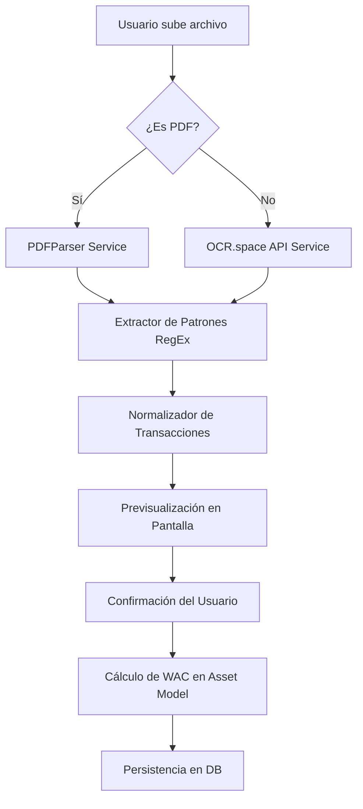

# Memoria Técnica del Proyecto: Wealth Manager

**Autor:** Rafael  
**Tutor:** Analista Senior de Desarrollo  
**Especialidad:** Desarrollo de Aplicaciones Web (DAW)

---

## 1. Resumen Ejecutivo
**Wealth Manager** nació de una frustración personal: tener activos repartidos por tres brokers, dos bancos y un exchange de cripto, y no tener ni idea de cuánto dinero tenía realmente. Este proyecto es mi solución a ese "caos" financiero. A diferencia de las apps que solo anotan gastos, he construido un sistema que "bucea" en internet (Web Scraping) y lee documentos (OCR) para que el usuario no tenga que picar datos a mano. Es una herramienta diseñada por un desarrollador para cualquier persona que quiera tomar el control total de su patrimonio.

La plataforma no solo consolida datos, sino que aplica algoritmos de ingeniería financiera para normalizar precios de mercado en tiempo real, calcular rentabilidades ponderadas y ofrecer una visión holística de la salud financiera del usuario.

---

## 2. Objetivos del Proyecto

### 2.1. Objetivos Técnicos
*   **Automatización Real**: Desarrollar un motor en `app/Http/Controllers/PortfolioController.php` capaz de interpretar extractos bancarios en PDF y capturas de pantalla con una precisión elevada (superior al 90%), reduciendo drásticamente el error humano en la entrada de datos.
*   **Abstracción de Datos**: Crear una capa de servicios en `app/Services/MarketDataService.php` que unifique fuentes heterogéneas (Morningstar, CoinGecko, EODHD) bajo una misma interfaz fluida y desacoplada del proveedor final.
*   **Cómputo Preciso**: Implementar el algoritmo de **Costo Promedio Ponderado (WAC)** y el cálculo de **TWR (Time-Weighted Return)** para que el beneficio (P/L) refleje fielmente la realidad económica, manejando eventos corporativos como splits o dividendos.
*   **Reactividad de Vanguardia**: Lograr una experiencia de usuario fluida mediante el uso de **Inertia.js** y **Vue 3**, minimizando las recargas de página y los tiempos de latencia percibidos.

### 2.2. Objetivos de Usuario
*   **Ahorro de Tiempo**: Reducir el tiempo dedicado a la gestión de carteras en un 75% respecto a métodos manuales.
*   **Visión 360º**: Ofrecer una granularidad total sobre la exposición por sectores, industrias, regiones y divisas, permitiendo una toma de decisiones informada.
*   **Seguridad y Privacidad**: Implementar un "Modo Privacidad" que permita al usuario revisar sus cuentas en entornos públicos sin exponer cifras sensibles.

---

## 3. Justificación Tecnológica

### 3.1. Arquitectura: Laravel 12 + Inertia + Vue 3
La elección del stack no fue casual. **Laravel 12** ofrece una base sólida para el backend con su ORM Eloquent y un sistema de colas robusto. **Inertia.js** actúa como el puente perfecto: nos permite construir una aplicación de tipo SPA (Single Page Application) sin la complejidad de gestionar una API REST/GraphQL por separado, manteniendo toda la lógica de rutas y controladores en el servidor.

### 3.2. Ecosistema de Librerías Críticas
*   **`smalot/pdfparser`**: Vital para la extracción de texto estructurado de PDFs de inversión.
*   **`symfony/dom-crawler` y `guzzlehttp/guzzle`**: La combinación maestra para el scraping resiliente.
*   **`laravel/socialite`**: Gestión segura de identidades mediante Google OAuth.
*   **`tightenco/ziggy`**: Permite usar las rutas de Laravel directamente en los componentes de Vue de forma tipada.
*   **`chart.js`**: El motor gráfico que da vida a la telemetría financiera.

---

## 4. Arquitectura de Sistema y Flujo de Datos

### 4.1. Diagrama de Lógica de Importación (OCR/PDF)

### 4.2. El corazón de la base de datos
He diseñado el esquema en `database/migrations/` buscando que nada se pierda y que la integridad sea total. Las relaciones principales que sostienen la lógica son:
*   **User → Portfolio**: Relación One-to-Many. Permite segmentar carteras por estrategia (Trading, Dividendos, Indexados).
*   **Portfolio → Asset**: Un activo financiero puede pertenecer a varios portafolios de forma independiente.
*   **Asset → Transaction**: El historial completo de vida de un activo. Cada transacción recalculas las métricas `cost_basis` y `balance`.
*   **Asset ↔ MarketData**: Vinculación mediante Tickers (AAPL, BTC, etc.) para la obtención automatizada de precios.

---

## 5. Ingeniería de Software y Calidad de Código

### 5.1. Principios SOLID y Patrones de Diseño
Para este proyecto, se ha seguido un enfoque de desarrollo senior:
- **Service Pattern**: Toda la lógica de negocio pesada vive en `app/Services`. Los controladores solo orquestan la petición y la respuesta.
- **Factory/Strategy Pattern** en `MarketDataService`: Dependiendo del tipo de activo (Crypto, Stock, Fund), se utiliza un proveedor de datos distinto de forma transparente para el resto del sistema.
- **Inversión de Dependencias**: El sistema depende de abstracciones, no de implementaciones concretas de APIs de mercado.

### 5.2. Mantenibilidad y Modularización
- **Componentización Extrema**: En `resources/js/Components`, cada gráfico, tabla o tarjeta de KPI es un átomo independiente con su propia lógica de CSS (Tailwind) y JS.
- **Centralización de Utilidades**: La lógica de formateo (monedas, fechas, colores) está centralizada en `resources/js/Utils/formatting.js`.

---

## 6. Endpoints y Routing (Estructura de la Aplicación)

La aplicación se divide en áreas lógicas bien diferenciadas, gestionadas a través de controladores especializados.

| Área | Controller | Responsabilidades |
| :--- | :--- | :--- |
| **Núcleo** | `DashboardController` | Orquestación de KPIs globales y estados del patrimonio. |
| **Operativa** | `TransactionController` | CRUD de movimientos y motor de cálculo de plusvalías. |
| **Importación** | `PortfolioController` | Procesamiento de OCR, PDF y vinculación manual. |
| **Inteligencia** | `AnalystController` | Integración con IA para informes personalizados de cartera. |
| **Administración** | `AdminController` | Telemetría del sistema, monitorización de APIs y backups. |

---

## 7. Desafíos Técnicos Superados

### 7.1. El Reto del Scraping Resiliente
 मॉर्निंगस्टार (Morningstar) y otros portales financieros cambian su estructura HTML frecuentemente. Se ha implementado un sistema de **Fallbacks en Cascada**:
1. Intenta obtener el precio de una API premium.
2. Si falla (o no existe el activo), aplica Scraping con XPath específico.
3. Si el Scraping devuelve error, busca en un proveedor de respaldo.
4. Como última instancia, mantiene el precio anterior y marca el activo como "Requiere Revisión".

### 7.2. Normalización de Datos OCR
El OCR no es perfecto. Suele confundir `8` con `B` o `0` con `O`. He implementado un motor de limpieza basado en expresiones regulares y comparativas de Levenshtein para asegurar que los nombres de los activos coincidan con nuestra base de datos maestra de tickers.

---

## 8. Guía de Instalación y Despliegue

### Requisitos Previos
- PHP 8.2+ e Composer.
- Node.js 18+ y NPM.
- SQLite o MySQL para la base de datos.
- Clave de API de OCR.space (gratuita).

### Pasos de Instalación
1. **Clonar**: `git clone [...]`
2. **Backend**: `composer install`
3. **Frontend**: `npm install`
4. **Configurar**: `cp .env.example .env` y rellenar variables.
5. **Base de Datos**: `php artisan migrate --seed`. El seed inyecta activos de mercado reales para pruebas instantáneas.
6. **Lanzar**: `php artisan serve` y `npm run dev`.

---

## 9. Seguridad y Auditoría
- **Sanitización Total**: Laravel se encarga de prevenir inyección SQL y XSS por defecto.
- **Políticas de Acceso (Policies)**: Se ha implementado `PortfolioPolicy` para asegurar que ningún usuario pueda acceder a los datos de otro mediante manipulación de IDs en las rutas.
- **Copias de Seguridad**: El sistema de administración permite realizar snapshots de la DB antes de cambios críticos.

---

## 10. Conclusiones y Futuro (Roadmap)
Wealth Manager es un proyecto vivo. Lo que empezó como un script de Python para leer un Excel ha evolucionado en una plataforma de gestión financiera robusta.

**Próximos pasos en el Roadmap:**
- [ ] **Módulo de Rebalanceo**: Alertas automáticas cuando una clase de activo se desvía de su peso objetivo.
- [ ] **Integración PSD2**: Conexión directa con bancos mediante APIs oficiales (Open Banking).
- [ ] **App Móvil Nativa**: Uso de Capacitor para convertir el frontend de Vue en una aplicación móvil.

---
**Firmado:**  
Rafael, Desarrollador Principal.
os automáticamente hace que todo el esfuerzo haya valido la pena.

---
**Firmado:**  
Rafael, Desarrollador Principal.